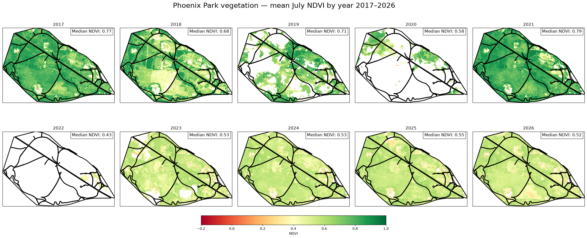

# Monitoring Vegetation Change in Phoenix Park Using Sentinel-2

A spatial analysis of July vegetation greenness in Dublin's Phoenix Park from 2017–2026 using Sentinel-2 satellite imagery, Python and QGIS.  

## 1. Project overview

It's been a hot, dry July in Europe in 2026, even in lush, green Ireland!  

I don't remember seeing the grass in Dublin so dry and yellow before — but is this year really that different from recent years?  

To find out, I took a look at vegetation greenness in Dublin's iconic Phoenix Park (Páirc an Fhionnuisce) over the past 10 years, using Sentinel-2 satellite imagery and NDVI (Normalized Difference Vegetation Index).  

NDVI is a widely used measure of vegetation greenness derived from satellite imagery. It compares the amount of near-infrared and red light reflected by the Earth's surface, with healthy vegetation typically reflecting strongly in the near-infrared and absorbing red light. Higher NDVI values therefore generally indicate greener, healthier vegetation.  

The analysis looks at NDVI across Phoenix Park for July of each year from 2017 to 2026, producing a series of pixel-level maps that show how vegetation greenness has varied across the park and whether the exceptionally hot, dry summer of 2026 really stands out.  

A follow-up analysis using QGIS examines vegetation change at a shorter temporal scale, comparing NDVI across Phoenix Park on 8 and 18 July 2026. The two Sentinel-2 acquisitions provide a spatial snapshot of how vegetation greenness changed over a 10-day period during hot, dry summer conditions.

## 2. Results  

The maps below show mean NDVI for each 10 × 10 m pixel in Phoenix Park for July of each year from 2017 to 2026. The same colour scale is used throughout, making it possible to compare vegetation greenness between years as well as changes in different parts of the park. Pixels without a valid vegetation observation remain blank.  

  

There is a noticeable difference between the earlier and later years in the series. July NDVI was generally higher in 2017–2021, while the maps from 2023 onwards show substantially lower vegetation greenness across much of the park. The contrast is particularly striking in 2026, when large areas of the park have lower NDVI values than in most of the earlier years.  

The spatial maps also show that this change is not uniform across the park. Some areas consistently maintain relatively high NDVI, while others show larger year-to-year changes. This highlights an advantage of using pixel-level satellite data: rather than reducing the park to a single number for each year, the analysis shows where changes in vegetation greenness are occurring.  

The median NDVI values provide a simple summary of the overall pattern, but the maps are arguably more informative than the summary statistic alone. They show both the magnitude and spatial distribution of vegetation greenness, and make it possible to see which parts of the park are contributing to the differences between years.  

Overall, the analysis suggests that the exceptionally dry summer of 2026 was associated with noticeably lower vegetation greenness in Phoenix Park compared with several earlier years in the 2017–2026 period. However, this ten-year time series is relatively short, and the analysis cannot by itself determine whether the observed changes represent a long-term trend or establish their underlying causes.  

## 3. Methodology

The analysis uses Sentinel-2 satellite imagery to measure vegetation greenness across Phoenix Park during July of each year from 2017 to 2026.

The park boundary was obtained as a polygon (from https://data.gov.ie/dataset/parks-gardens-and-public-spaces-dcc) and reprojected to the Sentinel-2 UTM coordinate reference system. Sentinel-2 scenes covering the park were identified using their acquisition date and metadata, and the relevant spectral bands were loaded at 10 m spatial resolution.

For each scene, NDVI was calculated from the red (B04) and near-infrared (B08) bands:

$$
NDVI = \frac{B08 - B04}{B08 + B04}
$$

The Sentinel-2 Scene Classification Layer (SCL) was then used to exclude clouds, water and other non-vegetated or invalid pixels. Only pixels classified as vegetation were retained for the analysis.  

Where multiple suitable observations were available within a year, the valid NDVI observations were combined on a pixel-by-pixel basis to produce an annual July mean. This means that each map represents the mean NDVI for each pixel based on the valid observations available for that location during July. Pixels with no valid vegetation observation remain blank.  

The resulting annual maps were clipped to the Phoenix Park boundary and plotted using a common NDVI colour scale, allowing spatial and temporal changes in vegetation greenness to be compared directly. A median NDVI value was also calculated for the park for each year to provide a simple numerical summary alongside the pixel-level maps.  

The analysis was carried out in Python using geospatial and scientific computing libraries including `pystac-client`, `odc-stac`, `xarray`, `GeoPandas` and `Matplotlib`.  

## 4. Limitations

This analysis has several limitations, including (but not limited to) the following:  
- July represents only a single month of each year, so the results do not capture changes in vegetation throughout the full growing season.  
- Cloud and quality masking also mean that the number of valid observations varies between years, and the annual pixel values are composites of available observations rather than measurements taken on exactly the same day each year.  
- NDVI can also be influenced by factors other than vegetation health, including weather, seasonal conditions, atmospheric effects and park management.  
- Finally, a ten-year time series is relatively short for identifying long-term environmental trends, so the results should be interpreted as an indication of changes in vegetation greenness rather than evidence of a definitive long-term trend or its underlying causes.  

## 5. Short-term vegetation change: July 2026  

To complement the longer-term analysis, I used QGIS to examine vegetation condition at a finer temporal scale using two Sentinel-2 L2A acquisitions from 8th and 18th July 2026. These dates were selected as they were the only two dates with no cloud cover over the park in July 2026. NDVI was calculated from the red (B04) and near-infrared (B08) bands, with the Sentinel-2 Scene Classification Layer (SCL) used to retain vegetation pixels. Both maps use the same spatial extent and NDVI scale, allowing direct visual comparison of vegetation greenness across the three-week period.  

The comparison shows a moderate widespread reduction in vegetation greenness across the park from 8th July (mean NDVI  = 0.545) to 18th July (mean NDVI = 0.482), although the two-date comparison is intended as a descriptive snapshot rather than evidence of a longer-term trend.

<p align="center">
  
  
</p>


## 6. Technical Details

The main analysis was developed in Python using Sentinel-2 Level-2A imagery accessed through the Microsoft Planetary Computer STAC catalogue. QGIS was additionally used for interactive geospatial analysis and visualisation of individual Sentinel-2 acquisitions.  

The main tools and libraries used are: 

* **Python** - analysis and data processing  
* **Sentinel-2** - multispectral satellite imagery  
* **pystac-client** - searching the Sentinel-2 STAC catalogue  
* **odc-stac** - loading and working with STAC imagery  
* **xarray** - working with multidimensional raster data  
* **rioxarray** - CRS handling and clipping raster data to the Phoenix Park boundary
* **GeoPandas** - handling the Phoenix Park boundary and spatial operations  
* **NumPy** - numerical calculations, including NDVI  
* **Matplotlib** - plotting and visualisation  
* **QGIS** - raster inspection, spatial processing, vegetation masking and cartographic visualisation

The repository is organised into an exploratory notebook, a clean final analysis notebook, and reusable functions:  

```text
PhoenixPark/
├── README.md
├── notebooks/
│   ├── 01.exploration.ipynb
│   ├── 02.function_creation.ipynb
│   └── 03.final_analysis.ipynb
├── src/
│   └── ndvi_funcs.py
├── data/
│   └── dcc_parks_strategy2016_park_classification.geojson
├── qgis/
│   └── phoenix_park_20260718.qgz
└── requirements.txt
```

The exploratory notebook contains the investigation of the data sources and packages, the function_creation notebook is a record of the development process, and the final notebook contains the reproducible analysis used to generate the results presented here. Reusable processing and plotting functions are stored separately in `src/ndvi_funcs.py`.


## 7. Reproducibility

The analysis is designed to be reproducible from the code in this repository. The complete workflow is contained in [`3.final_analysis.ipynb`](notebooks/3.final_analysis.ipynb), with reusable processing and plotting functions in [`src/ndvi_funcs.py`](src/ndvi_funcs.py).  

To reproduce the analysis:  

1. Clone this repository.  
2. Create a Python environment and install the dependencies listed in `requirements.txt`.  
3. Open `3.final_analysis.ipynb` in Jupyter or VS Code.  
4. Run the notebook from start to finish.  

The Sentinel-2 imagery is accessed from the STAC catalogue rather than stored in the repository, keeping the project lightweight while allowing the analysis to retrieve the required satellite data when the notebook is run.  

The exploratory development process is also available in [`1.exploration.ipynb`](notebooks/01_exploration.ipynb) and [`2.function_creation.ipynb`](notebooks/2.function_creation.ipynb), which document the investigation of cloud cover, Scene Classification Layer (SCL) masking, scene selection and the development of the final analysis workflow.  

A supplementary QGIS analysis was used to examine individual Sentinel-2 acquisitions from July 2026 at a finer temporal scale. The QGIS project is included in qgis/, together with the final vegetation-masked NDVI rasters used in the map layouts. The original Sentinel-2 band and Scene Classification Layer (SCL) rasters are not stored in the repository; these were accessed as Cloud Optimized GeoTIFF (COG) assets through the Microsoft Planetary Computer STAC catalogue.  

The QGIS workflow included raster inspection, CRS handling, NDVI calculation, nearest-neighbour resampling of the SCL vegetation mask, raster masking and cartographic visualisation.